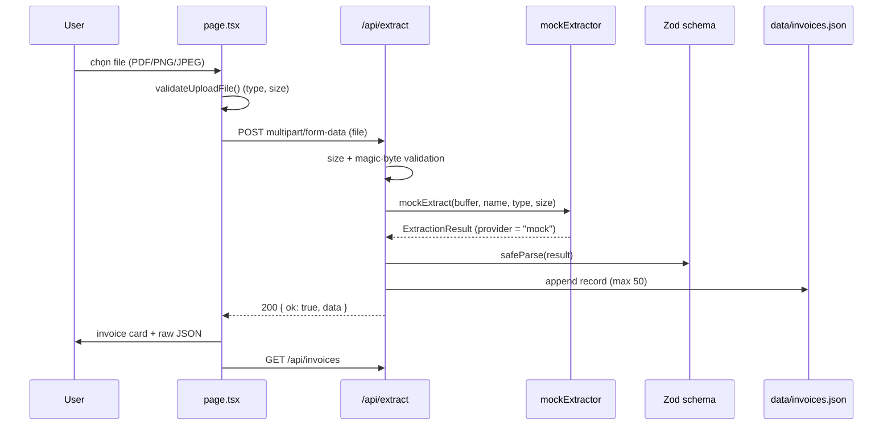

# Architecture Explanation

> **Source of truth for the architecture is `knowledge/architecture.md`.**
> This file is the short version required by `agents.md` and must stay consistent with it.
> Last updated: 30/09/2026 — describes the **actual** implementation (the LLM step is mocked).
> Validation status: `npm install`, typecheck, lint and 7 `curl` API cases PASS; browser click-through and a
> full `npm run build` are pending — evidence in `state/task_30_09_state.md` §5.

## 1. System Overview

A single Next.js (App Router) fullstack prototype. The browser renders one page with a submission box;
the server (Next.js API routes, Node runtime) validates the upload, produces structured invoice JSON,
validates it with Zod and stores it in a JSON file that stands in for the database.

| Layer | Implementation |
| --- | --- |
| Client | `app/page.tsx` + `components/UploadBox.tsx` / `InvoiceResult.tsx` / `InvoiceHistory.tsx` |
| Server | `app/api/extract/route.ts`, `app/api/invoices/route.ts` |
| Domain logic | `lib/mockExtractor.ts` (extraction), `lib/invoiceSchema.ts` (contract), `lib/uploadConfig.ts` (upload rules) |
| Storage | `lib/invoiceStore.ts` → `data/invoices.json` (mock database) |
| External APIs | **None** (the Multimodal LLM call is not implemented) |

## 2. Data Flow



## 3. Important Architectural Decisions

| Decision | Reason |
| --- | --- |
| Mock extraction behind the real Zod contract | Builds and demos the full pipeline now; a real LLM call replaces `mockExtract()` without touching the UI |
| Zod as the single response contract | Matches the "Structured Output Validation" goal in `project_details.md` |
| JSON file store instead of Prisma/SQLite | Zero dependencies, no migration risk; Prisma/SQLite is the documented next step |
| Client-safe constants in `lib/uploadConfig.ts` | `lib/mockExtractor.ts` / `lib/invoiceStore.ts` use Node APIs and must stay server-only |
| Plain CSS (no Tailwind) | No extra build configuration for a prototype |

## 4. External APIs and Credentials

* **Currently none** — the project runs without any API key.
* Planned: Multimodal LLM (OpenAI / OpenRouter / Gemini) with the key stored in `.env.local` (gitignored).
  This requires a human decision about provider, cost and quota (see `knowledge/apiDocs.md` §6).

## 5. Demo Flow

```text
git clone → open in DevContainer → npm install → npm run dev
 http://localhost:3000
 drag samples/sample-invoice.pdf into the submission box → "Tải lên & trích xuất"
 invoice card + line items + totals + raw JSON
 "3. Hóa đơn đã lưu" shows the stored record → "Tải file JSON" exports it
```

Step-by-step manual tests: `features.md`. Environment: `knowledge/configuration.md`.
