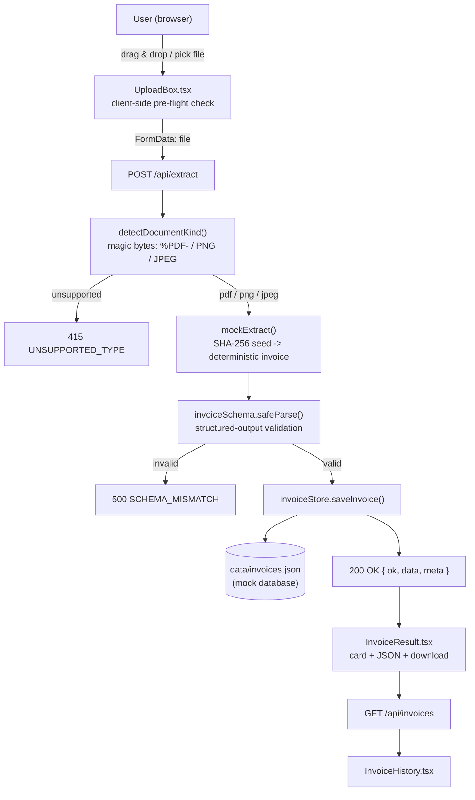
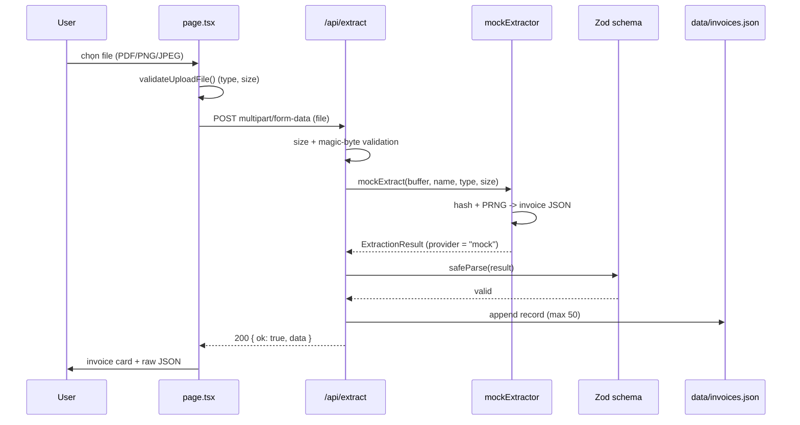

# Architecture

> Describes the **actual implementation** as of 30/09/2026.
> Everything not yet implemented is explicitly labelled **Planned / not implemented**.
> Related: `projectOverview.md` (what/why) · `apiDocs.md` (API contract) · `configuration.md` (environment)

---

## 1. Repository Structure

```text
ATI_PhAnh_group/
 .devcontainer/                 # DevContainer (Node 20.18.0 bookworm, port 3000)
 app/                           # Next.js App Router (real application)
   ├── api/
   │   ├── extract/route.ts       # POST  /api/extract   (upload → mock JSON → store)
   │   └── invoices/route.ts      # GET   /api/invoices  (list) + DELETE (reset)
   ├── globals.css                # Plain CSS (no Tailwind)
   ├── layout.tsx                 # Root layout / metadata
   └── page.tsx                   # Client page: upload box + result + history
 components/
   ├── UploadBox.tsx              # Submission box: drag&drop + file picker + status pill
   ├── InvoiceResult.tsx          # Invoice card, line items, totals, raw JSON, download
   └── InvoiceHistory.tsx         # List of stored invoices + refresh/reset
 lib/
   ├── invoiceSchema.ts           # Zod contract (single source of truth for the JSON shape)
   ├── mockExtractor.ts           # Mock "LLM": file → invoice JSON (server only, node:crypto)
   ├── invoiceStore.ts            # Mock database: data/invoices.json (node:fs)
   ├── uploadConfig.ts            # Shared upload rules (client-safe, no Node imports)
   └── format.ts                  # VND / bytes / date / percent formatting
 scripts/make-sample-pdf.mjs    # Generates samples/sample-invoice.pdf (test fixture)
 samples/sample-invoice.pdf     # 2-page sample invoice for manual testing
 data/                          # Mock database directory (invoices.json is gitignored)
 knowledge/                     # Project knowledge (this documentation system)
 requestFromUsers/              # Original human requests
 state/                         # Task state / handoff
 features.md · todolist.md · architecture_explanation.md
 package.json · tsconfig.json · next.config.ts · eslint.config.mjs · .gitignore
```

---

## 2. Technology Stack (as implemented)

| Layer | Technology | Notes |
| --- | --- | --- |
| Framework | Next.js `15.5.26`, App Router | Installed via `npm install` (308 packages, `package-lock.json` committed on 30/09/2026) |
| UI library | React `19.1.0` | Client component `app/page.tsx` + presentational components |
| Language | TypeScript `^5`, `strict: true` | `npm run typecheck` (`tsc --noEmit`) |
| Validation | Zod `^4.6.5` | `lib/invoiceSchema.ts` — validates the extraction result before storage |
| Styling | Plain CSS (`app/globals.css`) | No Tailwind/PostCSS configured on purpose |
| Lint | ESLint 9 + `eslint-config-next` 15.5.26 | Flat config `eslint.config.mjs`; see known risk in §8 |
| Storage | Local JSON file `data/invoices.json` | Mock database via `node:fs` (not Prisma/SQLite yet) |
| Runtime | Node.js `20.18.0` (devcontainer) | Port 3000 |
| External services | **None** | The LLM call is mocked; no API key required |

---

## 3. Components and Responsibilities

| Component | File | Responsibility |
| --- | --- | --- |
| Upload page | `app/page.tsx` | Owns UI state (file, status, error, result, history); calls the API routes |
| Submission box | `components/UploadBox.tsx` | Drag & drop / file picker, shows selected file, upload + reset buttons, status pill |
| Result view | `components/InvoiceResult.tsx` | Invoice fields, line-item table, totals, raw JSON, download JSON |
| History view | `components/InvoiceHistory.tsx` | Lists stored invoices, refresh, clear all |
| Upload rules | `lib/uploadConfig.ts` | Accepted types/extensions, 10 MB limit, `validateUploadFile()` used by the browser |
| Schema | `lib/invoiceSchema.ts` | Zod schemas + TypeScript types for `ExtractionResult` |
| Mock extractor | `lib/mockExtractor.ts` | Magic-byte kind detection, PDF page estimate, hash-seeded invoice generation |
| Mock DB | `lib/invoiceStore.ts` | `listInvoices` / `saveInvoice` / `clearInvoices` on `data/invoices.json` |
| API: extract | `app/api/extract/route.ts` | Validates the upload, runs the extractor, validates with Zod, stores, returns JSON |
| API: invoices | `app/api/invoices/route.ts` | Lists stored invoices / resets the mock database |

---

## 4. End-to-End Data Flow (implemented)



### Sequence (upload → JSON → database)



---

## 5. API Surface (summary)

| Method | Path | Purpose |
| --- | --- | --- |
| `POST` | `/api/extract` | Upload a PDF/PNG/JPEG, return + store the extraction result |
| `GET` | `/api/invoices` | List stored invoices (mock database) |
| `DELETE` | `/api/invoices` | Reset the mock database (demo helper) |

Details, payloads and error codes: `knowledge/apiDocs.md`.

---

## 6. External APIs

**None today.** The extraction step is mocked so the project runs without credentials.

**Planned / not implemented:** a Multimodal LLM provider (OpenAI / OpenRouter / Gemini) called from `app/api/extract/route.ts`, replacing `mockExtract()` while keeping the same Zod contract. Requirements: an API key in `.env.local` (never committed), a provider/library decision (e.g. Vercel AI SDK `generateObject`), and quota/pricing approval.

---

## 7. External Services / Credentials

* No service, account or key is required to run the current prototype.
* `.env*` is gitignored. Do not commit secrets (see `agents.md`).

---

## 8. Important Constraints and Known Limitations

1. **The extraction is mocked** — no document content is read. Output is derived from file magic bytes, size, SHA-256 hash (deterministic seed) and a PDF page-count heuristic. `issueDate` is anchored to "today", so a file's result can differ across days; `createdAt` / `processingMs` always change.
2. **Validation status (30/09/2026)** — `npm install`, `npm run typecheck`, `npm run lint` and 7 `curl` API cases all passed; two bugs were found and fixed during validation. A full `npm run build` and the browser click-through are still pending. Evidence: `state/task_30_09_state.md` §5.
3. **ESLint engine risk** — `eslint-visitor-keys@5` requires Node `^20.19.0 || ^22.13.0 || >=24`, but the image pins `node:20.18.0` (`npm warn EBADENGINE`). `npm run lint` may fail until the image is bumped (e.g. `node:20.19.0-bookworm`) or ESLint is removed.
4. **JSON file "database"** — single process, no locking, no queries, not suitable for serverless/multi-replica deployment, keeps max 50 records.
5. **No authentication / RBAC**; every request can read and reset the mock database.
6. **Upload limit** 10 MB; accepted: `application/pdf`, `image/png`, `image/jpeg` (client checks mime type or extension, server checks magic bytes).
7. **Client-safe constants** must stay in `lib/uploadConfig.ts`; `lib/mockExtractor.ts` and `lib/invoiceStore.ts` import `node:crypto` / `node:fs` and must never be imported by client components.

---

## 9. Design Decisions

| Decision | Reason |
| --- | --- |
| Mock extractor behind the real Zod contract | Lets the whole pipeline (UI, API, validation, storage) be built and demoed now; the LLM call becomes a drop-in replacement in `app/api/extract/route.ts` |
| Zod as the single response contract | Matches the project's "Structured Output Validation" goal (`project_details.md`) |
| JSON file store instead of Prisma/SQLite | Zero dependencies and no migration risk; `→ database` is demonstrable today. Prisma/SQLite is the documented next step |
| Plain CSS, no Tailwind | Avoids extra build configuration for a prototype |
| Upload rules duplicated client + server | Client gives instant feedback; the server stays authoritative |
| Deterministic, file-derived mock data | A demo is repeatable: the same file produces the same invoice numbers and amounts |

---

## 10. Demo Flow (after validation)

```text
npm install
npm run dev
 open http://localhost:3000
 drag samples/sample-invoice.pdf into the submission box
 "Tải lên & trích xuất"
 invoice card + line items + totals + raw JSON appear
 "3. Hóa đơn đã lưu" lists the record (data/invoices.json)
```

Manual test steps with expected results: `features.md`.

---

## 11. Planned / Not Implemented

* Real Multimodal LLM extraction with provider selection in the UI.
* Prisma + SQLite storage of invoices, users, departments, audit logs.
* Authentication + department-scoped RBAC.
* Batch jobs / model selection per job.
* Automated tests (no test runner is configured yet).
